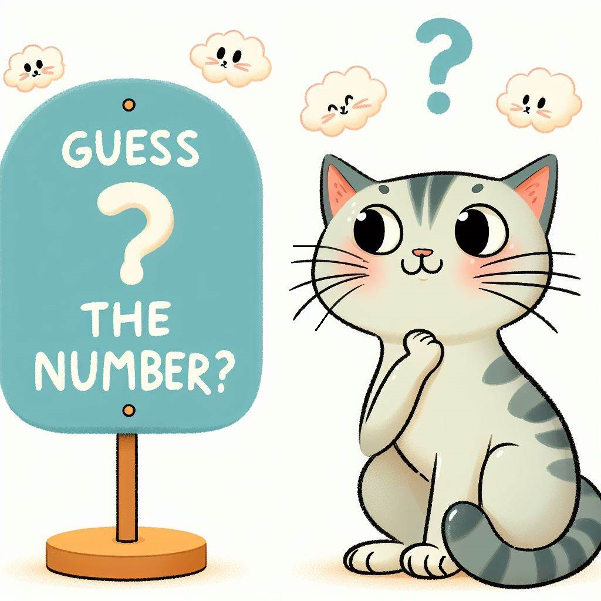
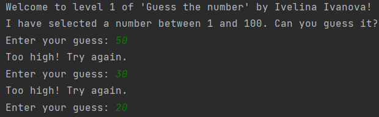
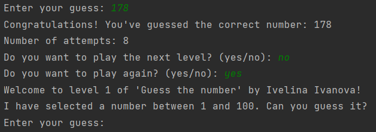

<h1 align="center">GuessTheNumberByIvelinaIvanova</h1>

  

## Project Description
"GuessTheNumberByIvelinaIvanova" is a console-based game implemented in Java. The game challenges players to guess a randomly selected number within a specified range. After each number you enter, the computer will give you a hint of whether the number is greater or less than the number you selected until you guess the correct number. It offers progressively increasing difficulty with each level.

## Features
- Generates a random number within a predefined range.
- Provides feedback on player guesses (too high, too low).
- Progresses through multiple levels, expanding the range of possible numbers.
- Utilizes concepts of loops, conditional statements, and user input/output.

## Technologies Used
- Java programming language

## Source Code
Find the source code for the project on GitHub: [GuessTheNumberByIvelinaIvanova.java](https://github.com/IvetoIvanova/GuessTheNumberByIvelinaIvanova/blob/main/GuessTheNumber.java)

## Getting Started
To run the game locally:
1. Clone this repository.
2. Compile the Java files.
3. Run the compiled Java program.

## Usage
1. Launch the game.
2. Follow the prompts to guess the randomly selected number.
3. Receive feedback on your guesses and attempt to guess the number.
4. Progress through multiple levels by successfully guessing the number.

## Screenshots

## Contributing
Contributions are welcome! Fork the repository and submit a pull request with your improvements.

## License
This project is licensed under the [MIT License](LICENSE).
